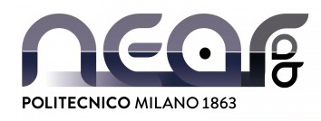
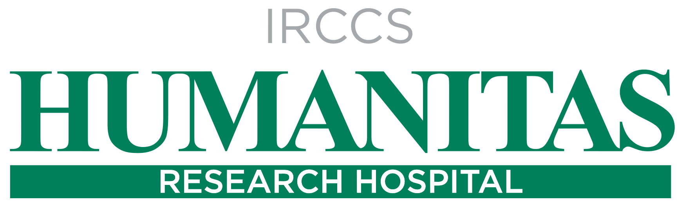

  
  <h1 align="center">Automated Colorectal Polyp Detection in Colonoscopy</h1>

<table align="center" style="background-color:rgba(0,0,0,0);">
  <tr style="background-color:rgba(0,0,0,0);">
    <!-- <td></th> -->
    <td>
	  </th>
</table>

  

Automated colorectal polyp detection using Deep Learning in colonoscopy-video images from the [SUN Dataset](http://sundatabase.org/). 

# Table of Contents
* [Introduction](#introduction)
* [Installation](#installation)
* [Contacts & Acknowledgements](#contacts--acknowledgements)

# Introduction

# Installation

# Contacts & Acknowledgements

This project is being carried out and developed as part of my Master's Thesis, in collaboration with the [Medical Robotics Section (MRSLab)](https://nearlab.polimi.it/medical/) of [PoliMi's NEARLab](https://www.deib.polimi.it/eng/deib-labs/details/67) and [Humanitas Research Hospital](https://www.humanitas.it/). 

If you have any further inquiries, questions, or would like any additional information, please feel free to contact any of the belowed-mentioned contacts.

| **Name** | **Position** | **Role** |
|:---------|:-------------|:---------|
| [Minh Tam Davide Huynh](https://www.linkedin.com/in/minh-tam-huynh/) | M.Sc. Biomedical Engineering Student @ Politecnico di Milano | Developer |
| [Alessandro Casella](https://nearlab.polimi.it/medical/alessandro-casella/) | Ph.D Biomedical Engineering Student @ Politecnico di Milano | Supervisor |
| [Prof. Elena De Momi](https://nearlab.polimi.it/medical/elenadem/) | Associate Professor in the Electronic, Information and Bioengineering Department (DEIB) @ Politecnico di Milano | Supervisor |
